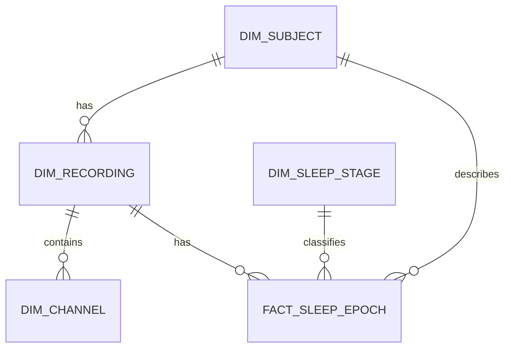

# Data Model

This document defines the current and planned data model for the NeuroSleep Lakehouse Platform during **Phase 6: Warehouse Modeling**.

It separates three states clearly:

- **implemented** structures in Bronze, Silver, PostgreSQL staging, and the Warehouse Core;
- **implemented governance and dbt validation** around the current Warehouse Core;
- **future scope** that must not be implemented before a trusted upstream dataset and grain exist.

The platform uses normalized relational modeling for operational, quality, governance, and staging data, and dimensional modeling for analytical warehouse and mart data.

## 1. Modeling Principles

1. Define table grain before defining columns.
2. Keep logical source identity separate from concrete processed versions.
3. Preserve Bronze and Silver lineage in PostgreSQL.
4. Use warehouse surrogate keys without discarding source and Silver identifiers.
5. Keep source-preserving values available when analytical mappings are added.
6. Make every load idempotent and testable.
7. Keep high-volume signal samples in Parquet instead of PostgreSQL row by row.
8. Do not create facts before their trusted upstream datasets exist.
9. Treat subject-level sleep data as restricted even though Sleep-EDF is open access.
10. Avoid additional tables that do not serve the current project scope.

## 2. Implemented Upstream Structures

### 2.1 Bronze, operations, quality, and governance

Implemented PostgreSQL structures include:

```text
raw.file_registry
ops.pipeline_run
ops.file_attempt
quality.quarantine_records
quality.quality_check_results
governance.source_system_registry
governance.data_contract_registry
governance.column_classification
```

`raw.file_registry` is the authoritative registry for Bronze source objects. It stores object location, source URL, size, SHA-256 checksum, ingestion run, and status.

`ops.pipeline_run` and `ops.file_attempt` provide run-level and file-level execution history.

`quality.quarantine_records` stores rejected-record metadata and optional pointers to large payloads in MinIO.

`quality.quality_check_results` stores durable quality-check history for Bronze, Silver, PostgreSQL, and later analytical layers.

### 2.2 Implemented Silver recording datasets

The recording pipeline publishes these versioned Parquet datasets to MinIO Silver:

```text
recordings
channels
sleep_stage_intervals
sleep_stage_epochs
signals
```

They use explicit PyArrow schemas, Zstandard compression, SHA-256 payload checksums, `_SUCCESS.json` manifests, reconciliation, partial-output recovery, and idempotent reruns.

| Dataset | Grain | Main identity |
|---|---|---|
| `recordings` | One concrete materialized Silver recording version | `recording_id` |
| `channels` | One channel in one concrete Silver recording version | `channel_id` |
| `sleep_stage_intervals` | One source annotation interval | `interval_id` |
| `sleep_stage_epochs` | One emitted 30-second epoch | `epoch_id` |
| `signals` | One signal sample for one channel | `recording_id + channel_id + sample_index` |

#### `recordings`

```text
recording_id
source_system
psg_bucket
psg_object_key
hypnogram_bucket
hypnogram_object_key
recording_start
duration_seconds
channel_count
annotation_count
in_range_epoch_count
out_of_range_epoch_count
trailing_overhang_seconds
```

#### `channels`

```text
channel_id
recording_id
position
source_label
normalized_name
sampling_frequency_hz
physical_dimension
physical_min
physical_max
digital_min
digital_max
samples_per_data_record
prefiltering
```

#### `sleep_stage_intervals`

```text
interval_id
recording_id
source_annotation_index
onset_seconds
duration_seconds
end_seconds
source_label
normalized_stage
overlap_status
```

Source annotations may start before the PSG boundary, so interval `onset_seconds` may be negative.

#### `sleep_stage_epochs`

```text
epoch_id
recording_id
source_interval_id
source_annotation_index
epoch_number
start_seconds
duration_seconds
end_seconds
source_label
normalized_stage
```

Epochs are recording-level facts, not channel-level facts. Each emitted epoch is exactly 30 seconds.

#### `signals`

```text
recording_id
channel_id
sample_index
elapsed_seconds
epoch_number
signal_value
```

Signal rows remain in MinIO/Parquet. They are not loaded into PostgreSQL row by row.

### 2.3 Implemented Silver subject metadata

The subject metadata pipeline publishes:

```text
subjects.parquet
recording_contexts.parquet
_SUCCESS.json
```

Current production output:

```text
100 subjects
197 recording contexts
```

#### `subjects`

Grain: one logical subject in one source collection.

```text
subject_key
source_system
dataset_version
collection
source_subject_id
source_subject_number
age_years
sex
source_bucket
source_object_key
```

`subject_key` is a deterministic SHA-256 business key derived from:

```text
source_system
+ dataset_version
+ collection
+ source_subject_id
```

It is stable and pseudonymous, but it must not be described as irreversible anonymization.

#### `recording_contexts`

Grain: one source context for one logical recording.

```text
recording_key
subject_key
source_system
dataset_version
collection
night_number
lights_off_seconds
treatment
source_bucket
source_object_key
```

Example logical recording keys:

```text
SC4001E
SC4002E
ST7011J
```

Night number, lights-off time, and treatment belong to recording context, not to the subject row.

## 3. Identity and Versioning

The platform uses separate identifiers for separate concepts.

| Identifier | Meaning |
|---|---|
| `subject_key` | Logical subject within source system, dataset version, and collection |
| `recording_key` | Logical Sleep-EDF recording or study night |
| `source_pair_id` | Logical PSG/Hypnogram object pair |
| `input_fingerprint` | Exact verified PSG/Hypnogram source bytes |
| `config_id` | Canonical Silver transform configuration |
| `recording_id` | One concrete materialized Silver recording version |

### 3.1 Logical recording business key

The logical Warehouse recording identity is:

```text
source_system
+ dataset_version
+ collection
+ recording_key
```

### 3.2 Version-aware Silver recording grain

One staged Silver recording version is unique by:

```text
source_system
+ source_pair_id
+ input_fingerprint
+ schema_version
+ transform_version
+ config_id
```

A changed input fingerprint, schema version, transform version, or configuration produces a different `recording_id`.

### 3.3 Required reconciliation

`recording_key` and `recording_id` are not interchangeable.

The Warehouse path must reconcile:

```text
recording_key
-> logical recording context
-> selected concrete recording_id
```

This mapping must reuse the existing Sleep-EDF source classification and batch recording identity. It must not depend on ad hoc string slicing in Warehouse SQL.

A Silver recording that cannot be matched to exactly one recording context must fail or be quarantined instead of being loaded as an orphan.

## 4. Current PostgreSQL Staging Model

Implemented tables:

```text
staging.silver_recordings
staging.silver_channels
staging.silver_sleep_stage_intervals
staging.silver_sleep_stage_epochs
```

The production loader for recording, channel, interval, and epoch datasets
is implemented. It loads only current compatible Silver publications and keeps
signal samples in MinIO. The subject-metadata staging loader is implemented
separately in Section 5.

### 4.1 `staging.silver_recordings`

Grain: one version-aware Silver recording publication.

The table preserves:

```text
recording_id
source_system
dataset_version
collection
recording_key
PSG and Hypnogram object locations
psg_file_id
hypnogram_file_id
source_pair_id
input_fingerprint
config_id
schema_version
transform_version
PSG and Hypnogram SHA-256 checksums
silver_bucket
silver_output_prefix
staging_load_run_id
loaded_at
recording metadata and row counts
```

Important uniqueness:

```text
source_system
+ source_pair_id
+ input_fingerprint
+ schema_version
+ transform_version
+ config_id
```

```text
silver_bucket + silver_output_prefix
```

The logical identity fields are stored directly in staging so later Warehouse
reconciliation can join to `staging.silver_recording_contexts` on:

```text
source_system
+ dataset_version
+ collection
+ recording_key
```

They are resolved by the existing Sleep-EDF source classification during the
recording staging load, not reconstructed by ad hoc Warehouse SQL string
parsing.

### 4.2 `staging.silver_channels`

Grain: one channel in one concrete staged Silver recording.

Important uniqueness:

```text
recording_id + position
recording_id + normalized_name
```

### 4.3 `staging.silver_sleep_stage_intervals`

Grain: one source annotation interval in one concrete staged Silver recording.

Important uniqueness:

```text
recording_id + source_annotation_index
```

Negative `onset_seconds` is allowed because source annotations may begin before PSG coverage.

### 4.4 `staging.silver_sleep_stage_epochs`

Grain: one emitted 30-second epoch in one concrete staged Silver recording.

Important uniqueness:

```text
recording_id + epoch_number
```

Epoch `start_seconds` remains non-negative.

## 5. Implemented Phase 6 Subject Metadata Staging

Migration `033_create_staging_silver_subject_metadata_tables.sql` implements:

```text
staging.silver_subjects
staging.silver_recording_contexts
```

Their contracts, governance classifications, focused schema smoke test,
and production staging loader are implemented.

The current production publication loads:

```text
100 subject rows
197 recording-context rows
0 orphan recording contexts
```

The loader validates `_SUCCESS.json`, file sizes, SHA-256 checksums, exact
Parquet schemas, publication lineage, and subject relationships. Both tables
are written in one transaction. An unchanged publication is skipped without
creating duplicates.

### 5.1 `staging.silver_subjects`

Grain: one subject row from one versioned Silver metadata publication.

Source fields:

```text
subject_key
source_system
dataset_version
collection
source_subject_id
source_subject_number
age_years
sex
source_bucket
source_object_key
```

Required publication lineage:

```text
metadata_input_fingerprint
schema_version
transform_version
silver_bucket
silver_output_prefix
staging_load_run_id
loaded_at
```

### 5.2 `staging.silver_recording_contexts`

Grain: one recording context row from one versioned Silver metadata publication.

Source fields:

```text
recording_key
subject_key
source_system
dataset_version
collection
night_number
lights_off_seconds
treatment
source_bucket
source_object_key
```

Required publication lineage:

```text
metadata_input_fingerprint
schema_version
transform_version
silver_bucket
silver_output_prefix
staging_load_run_id
loaded_at
```

The table must enforce a valid relationship from each context `subject_key` to the corresponding staged subject publication.

## 6. Implemented Phase 6 Warehouse Core

The implemented Warehouse Core contains:

```text
warehouse.dim_subject
warehouse.dim_recording
warehouse.dim_channel
warehouse.dim_sleep_stage
warehouse.fact_sleep_epoch
```

Staging preserves version-aware Silver history. The first Warehouse Core exposes one current analytical representation per logical recording and does not add a separate Warehouse recording-version history table. ADR 003 defines the physical key strategy, fail-closed version-selection rules, dbt materialization semantics, and build-consistency guarantees.

Until an explicit approved-version registry exists, Warehouse selection is fail-closed: more than one eligible metadata publication for a source collection or more than one eligible compatible Silver representation for one logical recording blocks the build instead of using an implicit latest-wins rule.

### 6.1 Logical ERD



### 6.2 Implemented Warehouse grain

| Table | Grain |
|---|---|
| `warehouse.dim_subject` | One row per logical subject |
| `warehouse.dim_recording` | One row per logical recording with one selected current Silver representation |
| `warehouse.dim_channel` | One row per channel in the selected recording representation |
| `warehouse.dim_sleep_stage` | One row per source-preserving normalized Silver stage code |
| `warehouse.fact_sleep_epoch` | One row per emitted 30-second epoch in the selected recording representation |

### 6.3 Key strategy

Warehouse surrogate keys use `_sk` so they are not confused with source, operational, or Silver identifiers. ADR 003 requires deterministic Warehouse keys that remain stable across full dbt rebuilds.

| Table | Warehouse key | Preserved identity |
|---|---|---|
| `warehouse.dim_subject` | `subject_sk` | `subject_key` |
| `warehouse.dim_recording` | `recording_sk` | `recording_key`, `silver_recording_id` |
| `warehouse.dim_channel` | `channel_sk` | `silver_channel_id` |
| `warehouse.dim_sleep_stage` | `sleep_stage_sk` | `silver_stage_code` |
| `warehouse.fact_sleep_epoch` | `sleep_epoch_sk` | `silver_epoch_id`, `silver_recording_id`, `epoch_number` |

`subject_sk`, `recording_sk`, `channel_sk`, and `sleep_epoch_sk` are deterministic hashed engineering keys. `sleep_stage_sk` uses fixed explicit integer values for the controlled reference dimension. Surrogate keys never replace lineage fields.

## 7. Implemented Warehouse Table Designs

Exact SQL types, contracts, tests, and supported physical constraints are defined in dbt Warehouse models. PostgreSQL migrations remain responsible for operational and staging structures, not for dbt-managed Warehouse table replacement.

### 7.1 `warehouse.dim_subject`

Grain: one logical subject.

Columns:

```text
subject_sk
subject_key
source_system
dataset_version
collection
age_years
sex
source_subject_id
source_subject_number
source_bucket
source_object_key
metadata_input_fingerprint
first_loaded_at
last_loaded_at
```

Rules:

- `subject_key` is unique.
- `subject_sk` is the Warehouse surrogate key.
- Source subject identifiers remain restricted lineage fields.
- Broad marts use `subject_sk` or aggregated outputs and do not expose source identifiers by default.

### 7.2 `warehouse.dim_recording`

Grain: one logical recording with one selected current Silver representation.

Columns:

```text
recording_sk
recording_key
subject_sk
source_system
dataset_version
collection
night_number
lights_off_seconds
treatment
silver_recording_id
recording_start
duration_seconds
channel_count
annotation_count
in_range_epoch_count
out_of_range_epoch_count
trailing_overhang_seconds
psg_file_id
hypnogram_file_id
source_pair_id
input_fingerprint
config_id
schema_version
transform_version
psg_checksum_sha256
hypnogram_checksum_sha256
silver_bucket
silver_output_prefix
staging_load_run_id
first_loaded_at
last_loaded_at
```

Rules:

- Logical business key:

  ```text
  source_system + dataset_version + collection + recording_key
  ```

- `recording_sk` remains the Warehouse surrogate key.
- `silver_recording_id` identifies the selected concrete Silver version.
- Subject and recording context must resolve before loading.
- `psg_file_id` and `hypnogram_file_id` preserve lineage to `raw.file_registry`.
- `silver_bucket` and `silver_output_prefix` preserve lineage to Silver Parquet objects.
- Recording-context attributes belong in this dimension because the relationship is one-to-one with the logical recording.

### 7.3 `warehouse.dim_channel`

Grain: one channel in the selected representation of one logical recording.

Columns:

```text
channel_sk
recording_sk
silver_channel_id
silver_recording_id
position
source_label
normalized_name
sampling_frequency_hz
physical_dimension
physical_min
physical_max
digital_min
digital_max
samples_per_data_record
prefiltering
first_loaded_at
last_loaded_at
```

Rules:

- `silver_channel_id` is preserved and unique.
- `recording_sk + position` is unique.
- `recording_sk + normalized_name` is unique.
- A channel must reference the same selected Silver version as its parent recording.

### 7.4 `warehouse.dim_sleep_stage`

Grain: one source-preserving normalized Silver stage code.

Columns:

```text
sleep_stage_sk
silver_stage_code
analytical_stage_code
```

Expected mapping:

| `silver_stage_code` | `analytical_stage_code` |
|---|---|
| `W` | `W` |
| `N1` | `N1` |
| `N2` | `N2` |
| `N3` | `N3` |
| `N4` | `N3` |
| `REM` | `REM` |
| `UNKNOWN` | `UNKNOWN` |
| `MOVEMENT` | `MOVEMENT` |

This preserves source Stage 3 and Stage 4 while allowing AASM-style analytical grouping. `UNKNOWN` and `MOVEMENT` stay explicit and are not silently treated as ordinary scored sleep.

### 7.5 `warehouse.fact_sleep_epoch`

Grain: one emitted 30-second epoch in the selected Silver recording representation.

Columns:

```text
sleep_epoch_sk
subject_sk
recording_sk
sleep_stage_sk
silver_epoch_id
silver_recording_id
source_interval_id
source_annotation_index
epoch_number
start_seconds
duration_seconds
end_seconds
source_label
silver_stage_code
staging_load_run_id
loaded_at
```

Rules:

- `sleep_epoch_sk` is the stable Warehouse fact identity derived from `recording_sk + epoch_number`.
- `silver_epoch_id` preserves exact Silver epoch identity and remains lineage rather than logical fact identity.
- `recording_sk + epoch_number` is unique in the current Warehouse state.
- `silver_recording_id + epoch_number` is unique.
- `subject_sk` directly references `dim_subject` for star-schema analysis.
- The fact `subject_sk` must agree with the parent `dim_recording.subject_sk`.
- `duration_seconds = 30.0`.
- `start_seconds >= 0`.
- `end_seconds > start_seconds`.
- Every epoch resolves to one subject, one recording, and one sleep-stage row.
- Epochs are not multiplied by channel.
- `source_interval_id` and `source_annotation_index` preserve annotation lineage.

## 8. Sleep-EDF Coverage Semantics

### Sleep Cassette

- Annotation intervals are expanded into 30-second epochs.
- Intervals outside PSG coverage do not produce in-range epoch facts.
- Source labels and normalized stages remain traceable.

### Sleep Telemetry

- Non-30-second-aligned recording duration is a warning.
- An unannotated PSG tail is a warning.
- A real epoch extending beyond PSG coverage is an error.
- The complete PSG signal remains in MinIO.
- Only real annotation-derived emitted epochs enter `warehouse.fact_sleep_epoch`.

Warnings remain in `quality.quality_check_results`; they are not converted into fabricated epoch rows.

## 9. Lineage

### Recording and epoch lineage

```text
warehouse.fact_sleep_epoch
-> warehouse.dim_recording
-> staging.silver_recordings
-> raw.file_registry
-> Bronze PSG/Hypnogram objects
```

### Silver object lineage

```text
warehouse.dim_recording
-> silver_bucket + silver_output_prefix
-> versioned Silver Parquet objects
-> _SUCCESS.json
```

### Subject metadata lineage

```text
warehouse.dim_subject
-> staging.silver_subjects
-> source_bucket + source_object_key
-> SC-subjects.xls or ST-subjects.xls
```

Important lineage values include:

```text
source_system
dataset_version
collection
subject_key
recording_key
silver_recording_id
silver_channel_id
silver_epoch_id
source_pair_id
input_fingerprint
config_id
schema_version
transform_version
psg_file_id
hypnogram_file_id
source checksums
silver_bucket
silver_output_prefix
staging_load_run_id
loaded_at
```

## 10. Data Quality and Referential Rules

### Subjects

- `subject_key` is non-null and unique.
- `age_years` is valid for the accepted source range.
- `sex` is `F` or `M`.
- Source and publication lineage is present.

### Recordings

- Every recording resolves to exactly one subject and one recording context.
- Every selected Silver recording has valid PSG and Hypnogram registry rows.
- Duration is positive and counts are non-negative.
- Logical recording business keys are unique in the current Warehouse state.
- One `silver_recording_id` cannot map to multiple logical recordings.

### Channels

- Every channel resolves to one recording.
- Position and sampling frequency are positive.
- Physical and digital ranges are valid.
- Position and normalized name are unique within a recording.

### Sleep stages

- Every normalized stage resolves to `dim_sleep_stage`.
- Unsupported labels fail the load.
- `UNKNOWN` and `MOVEMENT` remain explicit.

### Epochs

- Every epoch resolves to one subject, one recording, and one sleep stage.
- Fact `subject_sk` agrees with the subject attached to the same `recording_sk`.
- Epoch number and start time are non-negative.
- Duration is exactly 30 seconds.
- `recording_sk + epoch_number` is unique.
- `silver_recording_id + epoch_number` is unique for the selected representation.
- Epochs do not exceed allowed PSG coverage.

### Idempotency and publication safety

- Re-running the same staging load inserts no duplicates.
- Re-running Warehouse transformations produces the same logical Warehouse keys and no duplicate dimensions or facts.
- Warehouse selection does not use load order, timestamps, UUID ordering, or implicit latest-wins logic to choose an approved version.
- Ambiguous eligible metadata publications or recording representations fail closed.
- Each dbt table materialization uses its own database transaction semantics; Phase 6 does not claim one PostgreSQL transaction across the complete dbt DAG.
- A failed `dbt build` is not treated as a successfully published Warehouse state.

## 11. Privacy and Access Boundary

Sleep-EDF is open-access, but subject-level sleep data remains restricted inside the platform.

Quasi-identifying values include:

```text
source_subject_id
source_subject_number
age_years
sex
recording dates and times
collection
night and treatment context
```

Rules:

- Use `subject_sk` as the default analytical identifier.
- Preserve `subject_key` for controlled stable joins.
- Keep `source_subject_id` and `source_subject_number` in restricted lineage-oriented models.
- Do not expose source identifiers in broad marts unless specifically required.
- Do not claim that deterministic SHA-256 subject keys provide irreversible anonymization.
- Public Git contains code, configuration examples, contracts, and documentation only.

## 12. Load and Transformation Path

Intended flow:

```text
MinIO Silver Parquet
-> Python staging loader
-> PostgreSQL staging.silver_*
-> dbt sources and tests
-> dbt Warehouse dimensions and facts
-> marts after Warehouse Core stabilization
```

### Python staging loader responsibilities

- discover completed publications through `_SUCCESS.json`;
- verify object paths, sizes, checksums, schemas, and row counts;
- load Parquet rows into PostgreSQL staging;
- preserve publication lineage;
- track execution in `ops.pipeline_run`;
- use transactional and idempotent behavior.

### dbt responsibilities

- declare PostgreSQL staging sources;
- test uniqueness, non-null values, accepted values, and relationships;
- enforce fail-closed metadata-publication and recording-representation selection;
- reconcile logical recording keys with the single eligible concrete Silver representation;
- generate deterministic Warehouse surrogate keys;
- build contracted Warehouse dimensions and facts;
- validate cross-model relationships and source-to-Warehouse reconciliation;
- prevent duplicate or ambiguous current analytical representations.

Phase 6 implementation sequence completed for the current baseline:

```text
1. Warehouse grain and identity rules approved
2. subject/context staging DDL and contracts implemented
3. Silver-to-staging loaders implemented
4. dbt project, sources, selection gates, contracts, and tests implemented
5. Warehouse Core models implemented
6. rebuild safety, lineage, relationships, and row counts validated
7. marts and Gold outputs remain later scope
```

## 13. Deferred Models

These models are not part of Warehouse Core.

### `warehouse.fact_signal_quality`

Deferred until a trusted signal-quality dataset exists with an explicit per-channel window grain and defined metrics.

Pipeline quality warnings in `quality.quality_check_results` are not equivalent to analytical signal-quality windows.

### `warehouse.fact_device_event`

Deferred because no device-event source or Silver dataset exists.

### `warehouse.fact_recording_summary`

Deferred until the core dimensions and epoch fact are stable. It should be derived from Warehouse Core rather than loaded directly from Silver unless a later requirement says otherwise.

### Signal-feature facts

Deferred to Gold or a later feature-processing phase. Future features require their own grain, version, and lineage.

### Warehouse recording-version history

Not required for the first Warehouse Core. Version history remains available in Silver object storage and version-aware staging tables. Add a separate history table only if future analytical requirements justify it.

## 14. Mart Candidates

Marts are not implemented yet.

Candidates:

```text
mart.mart_subject_sleep_summary
mart.mart_recording_sleep_summary
mart.mart_sleep_stage_distribution
mart.mart_ml_sleep_stage_features
```

Each mart must define its grain before implementation. ML-ready tables must also document feature versions, subject-based data splitting, and leakage prevention.

## 15. Naming Conventions

- lowercase `snake_case`;
- `dim_` for dimensions;
- `fact_` for facts;
- `mart_` for consumption models;
- `_sk` for Warehouse surrogate keys;
- `_id` for source, operational, or concrete representation identifiers;
- preserve `subject_key` and `recording_key` as established business keys;
- `_at` for timestamps;
- `_date` for dates;
- `_seconds` for durations;
- `_count` for counts;
- `_sha256` for SHA-256 values.

Examples:

```text
subject_sk
subject_key
recording_sk
recording_key
silver_recording_id
sleep_stage_sk
input_fingerprint
loaded_at
duration_seconds
```

## 16. Current Status

Implemented:

```text
Bronze ingestion complete for the current scope
Bronze recovery, reconciliation, locking, and quality history implemented
Silver recording pipeline implemented and tested
Four Sleep Cassette recordings written
One Sleep Telemetry recording written
116,242,840 production Silver signal rows written
Silver subjects published with 100 subjects
Silver recording_contexts published with 197 contexts
Six Silver staging tables implemented
Silver identity and lineage ADR accepted
Warehouse grain and version-selection ADR accepted
Warehouse physical/build semantics ADR accepted
Warehouse Core implemented: 100 subjects / 5 recordings / 33 channels / 8 stages / 12,224 epochs
dbt fail-closed selection, contracts, relationship tests, and reconciliation implemented
Warehouse governance contracts active: 5 v1 contracts
Warehouse column classifications implemented: 81/81 columns
Durable quality-check history implemented
Core, reliability, and Silver smoke suites passing: 56/56
Warehouse dbt build passing: 201/201
```

Not implemented yet:

```text
mart and Gold models
deferred signal-quality and device-event analytical facts
full-source production processing
```

The relational staging and Warehouse Core paths are complete for the current
production baseline. Downstream models remain intentionally deferred until their
analytical grains and upstream datasets are defined.
