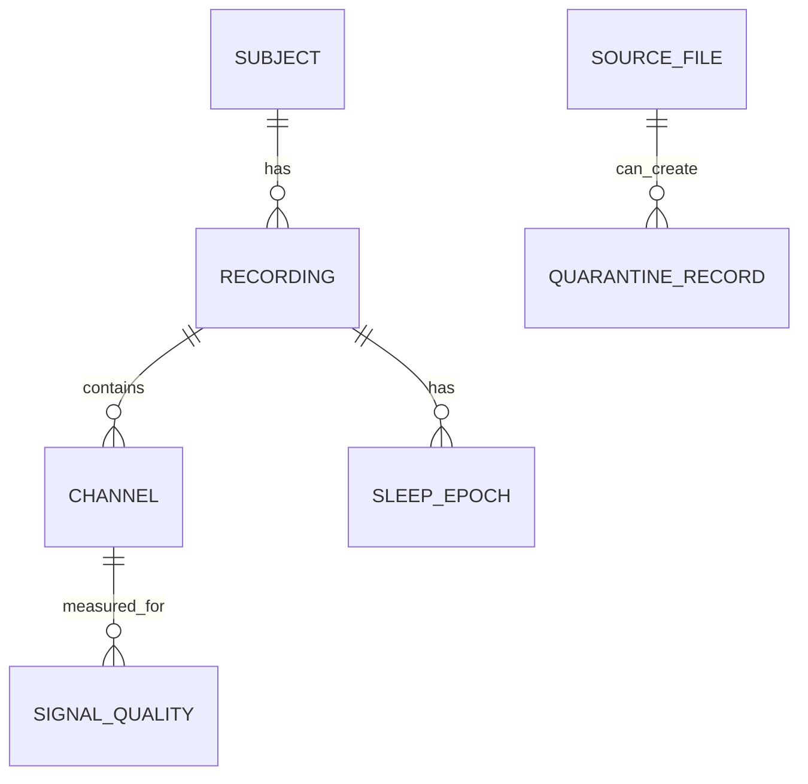

# Data Model

This document describes the first planned data model for the NeuroSleep Lakehouse Platform.

The model separates subjects, recordings, channels, sleep epochs, signal quality records, pipeline runs, file metadata, and quarantine records into different tables. This reduces duplication, improves data integrity, and makes relationships between entities clearer.

The design uses two modeling styles:

- Normalized modeling for metadata, operational, quality, and governance tables.
- Dimensional modeling for analytical warehouse and mart tables.

## 1. Core Entity Relationships

```text
subject
-> recording
-> channel
-> sleep_epoch

recording
-> signal_quality

source_file
-> recording_metadata
source_file
-> channel_metadata
source_file
-> quarantine_record
```

Meaning:

- One subject can have many recordings.
- One recording can have many channels.
- One recording can have many sleep epochs.
- One recording can have many signal quality windows.
- One source file can create metadata records.
- Bad records should link back to the source file when possible.

## 2. First Logical ERD



This is the first logical model. The final physical database can use slightly different table names depending on the layer.

## 3. Core Entities

| Entity         | Meaning                                      | Example Table                       |
|----------------|----------------------------------------------|-------------------------------------|
| source_file    | A raw file received from a source system      | raw.file_registry                   |
| subject        | A person or anonymized participant            | warehouse.dim_subject               |
| recording      | One sleep/EEG recording session               | warehouse.dim_recording             |
| channel        | One EEG or signal channel inside a recording  | warehouse.dim_channel               |
| sleep_epoch    | One sleep stage interval                      | warehouse.fact_sleep_epoch          |
| signal_quality | Quality metrics for signal windows            | warehouse.fact_signal_quality       |
| pipeline_run   | One execution of a pipeline step              | ops.pipeline_run                    |
| quarantine     | Rejected or suspicious records                | quality.quarantine_records          |
| data_contract  | Expected structure of an important table      | governance.data_contract_registry   |

## 4. Table Grain

Grain means what one row represents.

| Table                         | Grain                                                     |
|-------------------------------|-----------------------------------------------------------|
| raw.file_registry             | One row per ingested source file                          |
| raw.recording_metadata        | One row per extracted recording metadata record           |
| raw.channel_metadata          | One row per extracted channel metadata record             |
| warehouse.dim_subject         | One row per subject                                       |
| warehouse.dim_recording       | One row per recording                                     |
| warehouse.dim_channel         | One row per channel in a recording                        |
| warehouse.dim_sleep_stage     | One row per standardized sleep stage                      |
| warehouse.fact_sleep_epoch    | One row per sleep epoch                                   |
| warehouse.fact_signal_quality | One row per signal quality window per channel             |
| ops.pipeline_run              | One row per pipeline task or run                          |
| quality.quarantine_records    | One row per rejected or suspicious record                 |
| mart.mart_sleep_stage_distribution | One row per sleep stage summary grouping             |
| mart.mart_ml_sleep_stage_features  | One row per ML-ready sleep epoch feature record      |

Defining grain early prevents unclear tables later.

## 5. Key Strategy

The project should use clear primary keys and foreign keys.

| Table                         | Primary Key Candidate       | Important Foreign Keys                  |
|-------------------------------|-----------------------------|-----------------------------------------|
| raw.file_registry             | file_id                     | ingestion_run_id                         |
| raw.recording_metadata        | recording_metadata_id       | source_file_id                           |
| raw.channel_metadata          | channel_metadata_id         | source_file_id                           |
| warehouse.dim_subject         | subject_key                 | none                                     |
| warehouse.dim_recording       | recording_key               | subject_key, source_file_id              |
| warehouse.dim_channel         | channel_key                 | recording_key                            |
| warehouse.dim_sleep_stage     | sleep_stage_key             | none                                     |
| warehouse.fact_sleep_epoch    | epoch_key                   | recording_key, sleep_stage_key           |
| warehouse.fact_signal_quality | signal_quality_key          | recording_key, channel_key               |
| ops.pipeline_run              | run_id                      | none                                     |
| quality.quarantine_records    | quarantine_id               | source_file_id, pipeline_run_id          |

Early project versions can use natural source IDs when convenient, but the analytical warehouse should gradually move toward stable surrogate keys.

## 6. Normalization Strategy

Normalization is used where the system needs strong data integrity.

Normalized areas:

```text
raw
ops
quality
governance
some warehouse dimensions
```

Why:

- Avoid repeating the same subject, recording, or channel metadata in many rows.
- Make updates safer.
- Make foreign key relationships clear.
- Reduce inconsistent values.
- Make the model easier to extend later.

Example of a bad wide table:

```text
sleep_epoch_table
- subject_id
- subject_age
- subject_sex
- recording_id
- recording_start_time
- channel_name
- sleep_stage
- epoch_start_time
- epoch_end_time
```

Problem:

The same subject, recording, and channel values would repeat thousands of times.

Better normalized structure:

```text
dim_subject
dim_recording
dim_channel
fact_sleep_epoch
```

The repeated metadata is separated from the high-volume fact rows.

## 7. Analytical Modeling Strategy

For analytics, the project should use dimensional modeling.

Main fact tables:

```text
warehouse.fact_sleep_epoch
warehouse.fact_signal_quality
warehouse.fact_device_event
```

Main dimension tables:

```text
warehouse.dim_subject
warehouse.dim_recording
warehouse.dim_channel
warehouse.dim_sleep_stage
```

This creates a star-schema style model:

```text
dim_subject
    |
dim_recording
    |
fact_sleep_epoch
    |
dim_sleep_stage
```

This is useful because analysts and ML workflows can query the data more easily.

## 8. Layer-Specific Data Models

### Raw Layer

Purpose:

- Preserve metadata from source files.
- Track where each file came from.
- Track ingestion status and checksums.

Tables:

```text
raw.file_registry
raw.recording_metadata
raw.channel_metadata
```

Raw layer should not pretend that messy source data is clean.

### Silver Layer

Purpose:

- Clean and standardize data.
- Validate required values.
- Deduplicate records with clear rules.
- Link records back to source files.

Possible tables:

```text
silver_subjects
silver_recordings
silver_channels
silver_sleep_epochs
silver_signal_quality
silver_device_events
```

Silver is where raw values become trustworthy.

### Warehouse Layer

Purpose:

- Store structured facts and dimensions.
- Support analytical joins.
- Keep keys and relationships stable.

Tables:

```text
warehouse.dim_subject
warehouse.dim_recording
warehouse.dim_channel
warehouse.dim_sleep_stage
warehouse.fact_sleep_epoch
warehouse.fact_signal_quality
warehouse.fact_device_event
```

### Mart Layer

Purpose:

- Serve final business, analytics, and ML-ready tables.
- Reduce the number of joins needed by end users.

Tables:

```text
mart.mart_subject_sleep_summary
mart.mart_sleep_stage_distribution
mart.mart_ml_sleep_stage_features
```

Marts can be less normalized than raw or operational tables because they are built for reading and analysis.

## 9. Planned Important Columns

### raw.file_registry

```text
file_id
source_system
source_url
bucket
object_key
file_name
file_type
file_size_bytes
checksum_sha256
ingested_at
ingestion_run_id
status
```

### warehouse.dim_subject

```text
subject_key
source_subject_id
age
sex
source_system
first_seen_at
updated_at
is_anonymized
```

### warehouse.dim_recording

```text
recording_key
source_recording_id
subject_key
recording_start_time
recording_end_time
duration_seconds
source_file_id
source_system
loaded_at
```

### warehouse.dim_channel

```text
channel_key
recording_key
channel_name
channel_type
sampling_frequency
source_system
loaded_at
```

### warehouse.fact_sleep_epoch

```text
epoch_key
recording_key
sleep_stage_key
epoch_start_time
epoch_end_time
epoch_duration_sec
source_annotation_file_id
pipeline_run_id
loaded_at
```

### warehouse.fact_signal_quality

```text
signal_quality_key
recording_key
channel_key
window_start_time
window_end_time
missing_ratio
noise_score
artifact_score
signal_quality_score
is_usable
calculated_at
```

### quality.quarantine_records

```text
quarantine_id
source_system
source_file_id
record_key
raw_payload
error_code
error_message
severity
detected_at
pipeline_run_id
status
```

## 10. Sleep Stage Standardization

Sleep stage values should be standardized before they reach trusted analytical tables.

Allowed planned values:

```text
W
N1
N2
N3
REM
UNKNOWN
```

Possible source values:

```text
Wake
W
Sleep stage W
NREM 1
N1
NREM 2
N2
NREM 3
N3
REM sleep
REM
Movement time
Unknown
```

The project should document how every source label maps to the standard label.

Unknown or unsupported labels should not be silently accepted.

## 11. Data Quality Relationships

Quarantine records should connect bad data back to the source.

```text
quality.quarantine_records.source_file_id
-> raw.file_registry.file_id
```

Pipeline run information should connect processing failures back to the run.

```text
quality.quarantine_records.pipeline_run_id
-> ops.pipeline_run.run_id
```

This helps answer:

- Which file produced bad records?
- Which pipeline run detected the issue?
- What rule failed?
- Was the record rejected, warned, or fixed?

## 12. Data Lineage

Important final tables should preserve lineage columns.

Examples:

```text
source_system
source_file_id
pipeline_run_id
loaded_at
processed_at
feature_version
```

Lineage helps trace a final ML feature row back to the original source file and pipeline run.

## 13. Naming Conventions

Use consistent naming.

General rules:

- Use lowercase names.
- Use snake_case.
- Use singular names for dimensions when practical.
- Use `dim_` prefix for dimensions.
- Use `fact_` prefix for facts.
- Use `mart_` prefix for final mart tables.
- Use `_id` for source or natural identifiers.
- Use `_key` for warehouse surrogate keys.
- Use `_at` for timestamps.
- Use `_date` for dates.
- Use `_seconds` or `_sec` for durations.

Examples:

```text
subject_key
source_subject_id
recording_start_time
duration_seconds
processed_at
```

## 14. Design Decisions

Current decisions:

| Decision | Choice |
|----------|--------|
| Raw source files | Stored unchanged |
| Operational metadata | More normalized |
| Analytical warehouse | Star-schema style |
| Bad records | Stored in quarantine |
| Final ML table | Built from trusted silver/gold data |
| Subject split | Split by subject, not by row |

## 15. Questions To Revisit Later

These decisions can be revisited later:

- Should `silver` be stored only as Parquet, or also loaded into PostgreSQL?
- Should `warehouse` facts live in PostgreSQL or object storage?
- Should `subject_key` be generated in Spark, dbt, or PostgreSQL?
- Should sleep epochs be stored with one row per epoch only, or one row per epoch per channel?
- Should signal features be stored in the same ML table or a separate feature table?
- Should device events join directly to recordings or through sessions?

## 16. Current Status

Current status:

```text
Initial data model design.
```

The model is intentionally a first version. It should become more precise after the exact dataset sample is selected.
